 

 

### About
 
Full-stack developer and technical lead with 5+ years delivering 20+ end-to-end projects across React/Next.js, Python, PostgreSQL, and GIS visualisation. Led technology strategy and mentored a team of engineers across EU research partnerships at **Fondazione CMCC** (2021–2025), architecting decision-support and ocean-visualisation platforms from concept to production. Currently a freelance Technical Lead building the AI-augmented automation layer for a neuroscience-based digital leadership platform.

> In short: I am a dreamer who builds with a vision, a developer who creates with a purpose, and a leader who brings people, ideas, and possibilities together.
 
 

### Journey

| Period | Role | Organisation |
|---|---|---|
| **2025 – Present** | Technical Lead & Advisor (Freelance) | Leadership For Today (L4T) & Stress Concern International (SCI), UK |
| **2021 – 2025** | Full-Stack Developer & Technical Leader | Fondazione CMCC, Italy |
| **2020 – 2021** | Software Engineer | Politecnico di Milano, Italy |
| **2018 – 2020** | M.Sc, Computer Science & Engineering — 95/110 | Politecnico di Milano, Italy |
| **2014 – 2018** | B.Tech, Computer Science & Engineering — 9.43/10, Gold Medalist | Techno India University, Kolkata |
 
 

### The Stack
 

<b>Also:</b> RESTful APIs · Keycloak · GIS (MapServer, Leaflet, QGIS) · Tailwind CSS · Material UI · Java · CI/CD · Agile/Scrum · Claude Code

 

<!-- ### GitHub Pulse
 

  -->

### Beyond the Codebase
 
| Role | Organisation | Dates | Highlights |
|---|---|---|---|
| Founder & Organiser | Cultural Festival of India (Diwali & Holi) | Jan 2023 – Present | Independently planned and delivered annual celebrations; 200+ participants; managed artists, logistics, permissions, and safety |
| Intercultural Event Coordinator & Cultural Guide | FAI · *Ponte Tra Culture* | Nov 2024 – Present | Co-organised an international dance festival and International Mother Language Day; guided visitors through churches and historic monuments |
| Social Media Manager | Capoeira Salento | Oct 2024 – Present | Managed digital communications; built international collaborations with capoeira communities abroad |
| Public Speaker | The Berkeley Lecce | Oct 2022 | A personal talk on resilience and on Kolkata's cultural heritage and identity |
| Community Organiser | Couchsurfing | Mar 2022 – Present | Organise recurring social meetups connecting local and international participants |
 
 

Building systems that scale, and communities that stick around.

